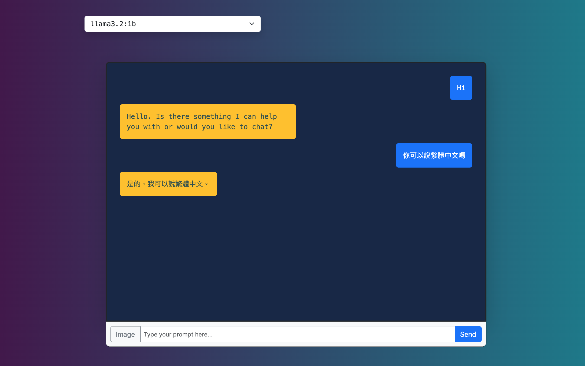

# Ollama Chat
A playground to chat with Ollama models.

## Prerequisites

- Ollama
- RVM

To install Ollama, you can use Docker:

```sh
docker run -d -v $HOME/ollama:/root/.ollama -p 11434:11434 --name ollama ollama/ollama
```

To install LLM models using the Ollama Docker container:

```sh
docker exec -it ollama ollama run llama3.2-vision
```

To install RVM, follow the instructions on the [official site](https://rvm.io/).

## Installation

To install Ruby 3.3.1 using RVM:

```sh
rvm install 3.3.1
rvm use 3.3.1 --default
```

To install dependencies using Bundler:

```sh
bundle install
```

To install JavaScript dependencies using Yarn (for compiling assets):

```sh
yarn install
```

To setup database schema:

```
bin/rails db:create db:migrate
```

## Running the Application

To start the application, you can use one of the following commands:

```sh
bin/dev
```
**Note: `bin/dev` will compile assets automatically before starting the server.**

or

```sh
rails server
```

After running the application, you should see the service page in your browser, which looks like the image below:


